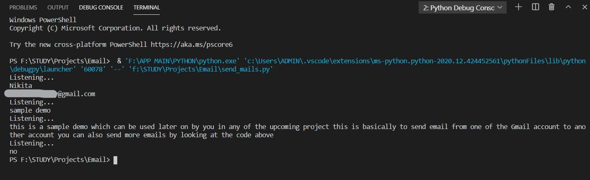
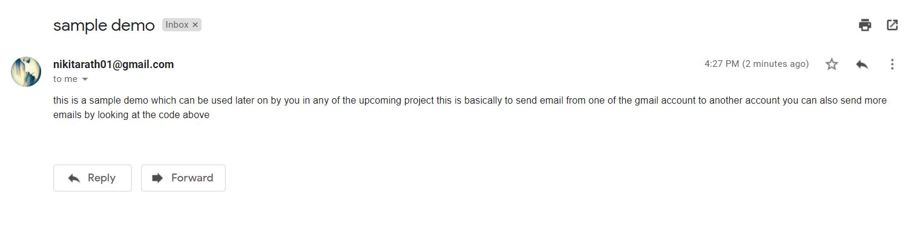

## Simple Automated Voice Controlled Email Sender using Python

No need to type mails anymore. Send unlimited emails automatically using STMP Protocol through any gmail account by Voice Instructions.

### Prerequisites

  1. Open Gmail -> Click on the Profile (right top corner)
  2. Click Manage your Google Account -> Security -> Less secure app access (turn ON)
  3. <B>Note - You gmail account should have 2-step verification turned off to see the above option</B>
  4. Else turn the off the verification and then follow step 2

### Installation Requirements (libraries)

  1. ```pip install SpeechRecognition```
  2. ```pip install PyAudio```
  
   In case it shows error or build wheel fails, go for -
     ```pip install pipwin``` & 
     ```pipwin install pyaudio```
    
   (pipwin helps to installs precompiled Windows binaries)

  3. ```pip install pyttsx3```

### Application

<div align='center'>

</div>

<div align='center'>

</div>

### Steps of Code Execution

  1. Clone / Download this [repository](https://github.com/nikita9604/Automated-Voice-Controlled-Email-Sender)
  2. Unzip the downloaded folder
  3. Open any python editor (Here, [VS Code](https://code.visualstudio.com/) is used)
  4. Run this [python file](https://github.com/nikita9604/Automated-Voice-Controlled-Email-Sender/blob/main/send_mails.py) to execute the application with Voice Commands.

### References

https://realpython.com/python-send-email/
